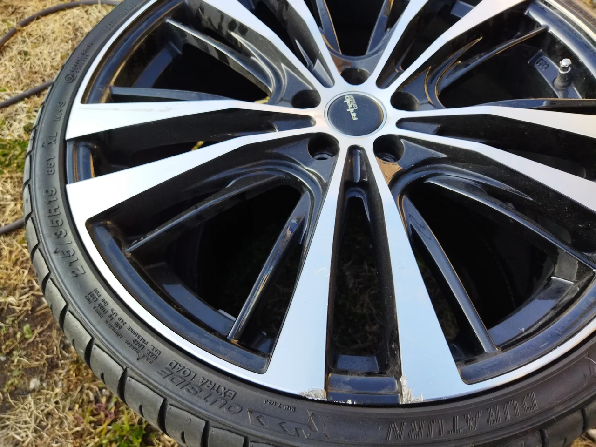
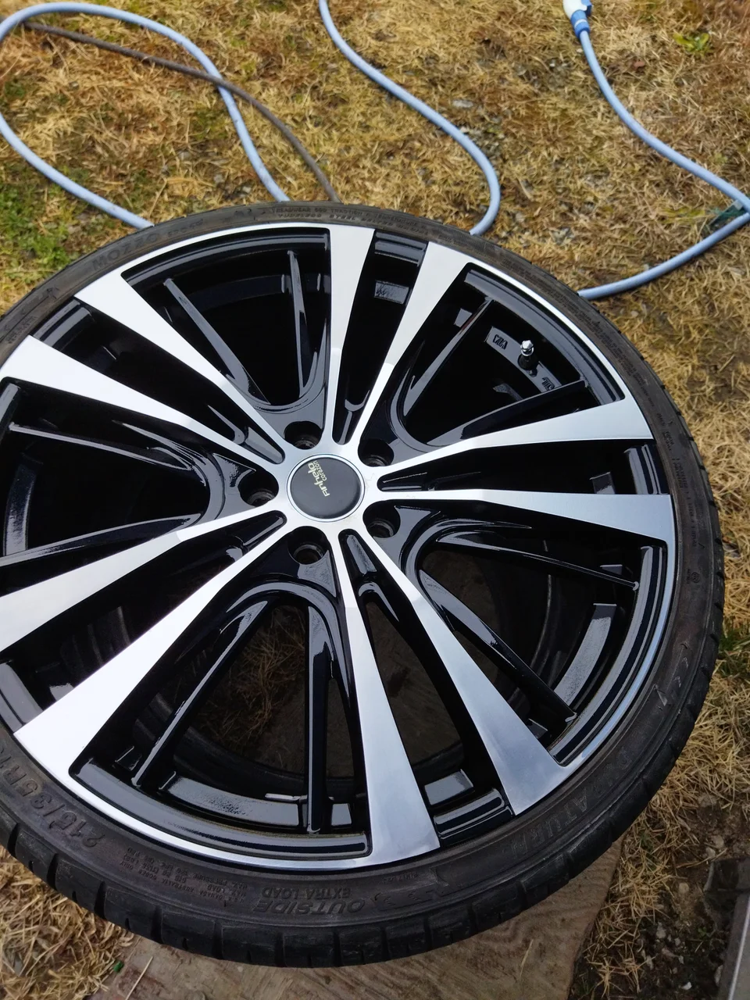
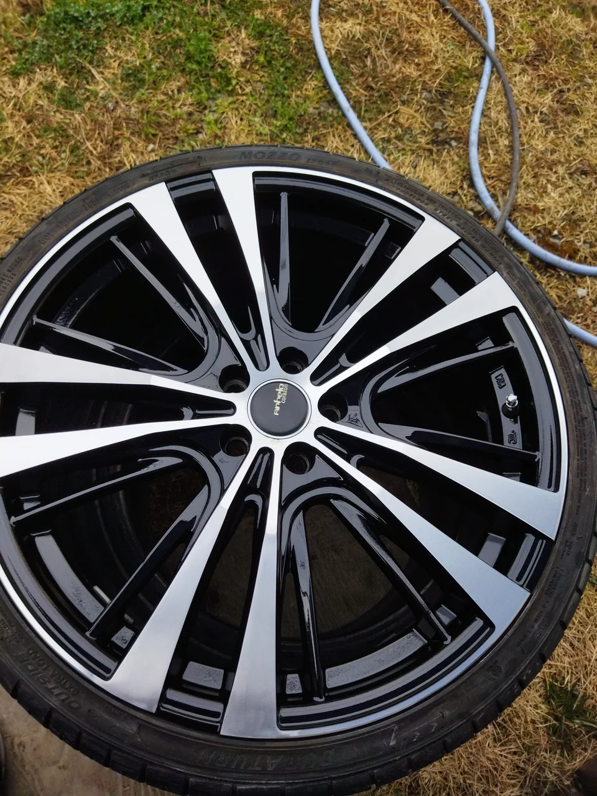

中秋の名月も過ぎていよいよ秋たけなわですが、西日本は何故かまだまだ暑いですね・・。

これも地球温暖化の影響なのでしょうか？皆様如何お過ごしでしょうか？

ところで、今回はダイヤカットホイール（ディスクの表面にキラキラとしたヘアラインが刻んであるやつです。）のリペアです。

ビフォーがこれ

この黒の塗装との境目の門にちょうど強く当たったキズがあります。

アフターがこれ

もう一枚

人間の手作業でどこまでできるか？とても大変ですが、これでほぼキズはわからなくなりました。

お困りの方はご相談ください。
