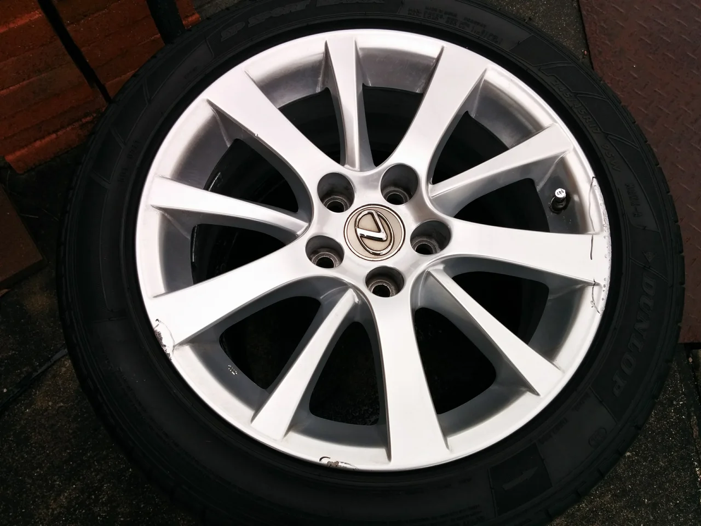
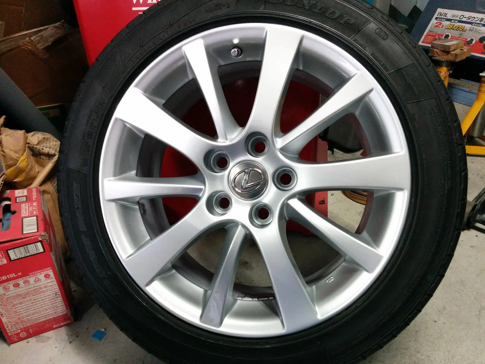

こんにちは、なんか朝晩寒くて布団から出るのが嫌になりますね。

それにもまして、物価高が止まりません、財布の中身もお寒いこのご時世に

なるべく出費を抑えて、それでいてクオリティーにもこだわる。当店はこの両方を達成できるように

努力しています。

今回はレクサスの純正ホイールです。

ビフォーがこれ

外周に目立つキズが入ってしまっています。残念・・・。

アフターがこれ

これですっかりわからなくなりましたね。

これでリペア料金は16000円（税抜） ぐらいです。

交換した場合の10～8分の1の値段で解決できます。

一本からでも持ち込み可です。 お困りの方はご相談ください。
