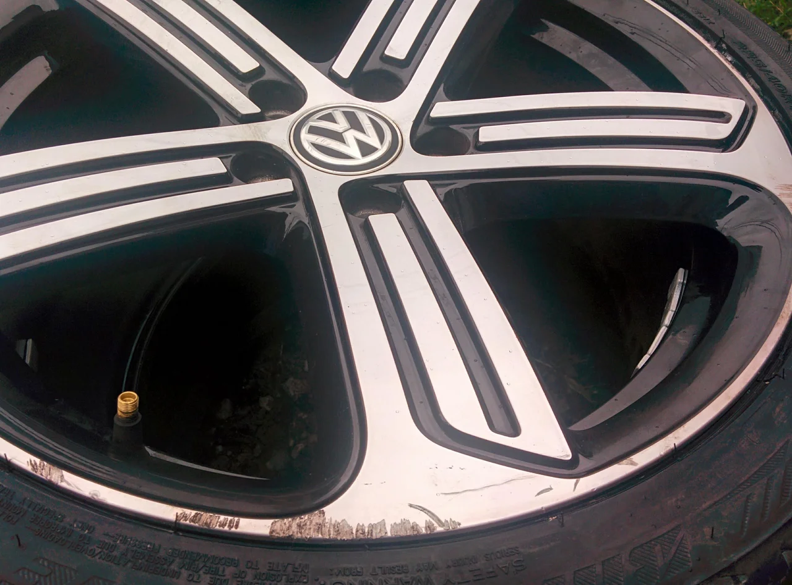
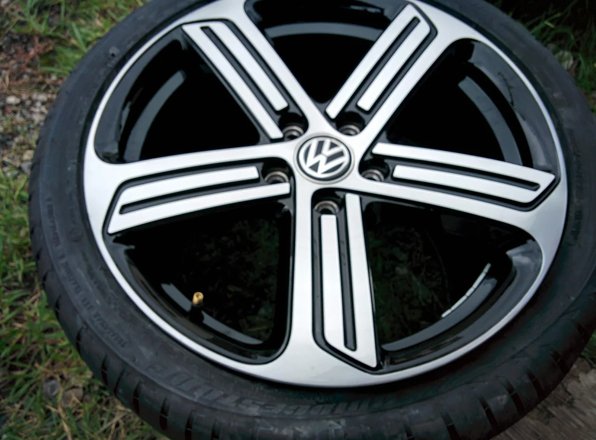

11月なのに台風が接近だなんてやはり温暖化の影響なのでしょうか？

そんな不安の中皆様いかがお過ごしでしょうか？

ところで、今回はフォルクスワーゲンの純正ホイールのリペアです。

ビフォーがこれ

美しい洗練されたデザインだけどこのキズで第なしですね・・・。

アフターがこれ

これはダイヤカットなので、細かいヘアラインまでは再現できませんが

お客様にはほとんどわからないと、満足していただけました。

これで頂いたお代金は15000円（税抜） です。

交換した場合の約1/8～1/10ぐらいの金額で解決できます。

お困りの方はご相談ください。
