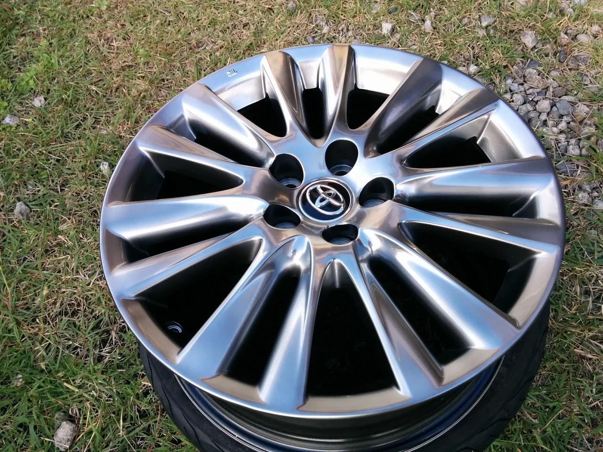
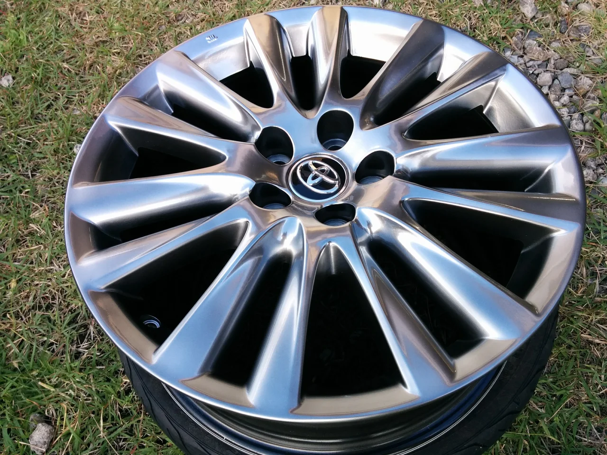

南の海上には台風がいたり、それでも北の方には寒気と油断ならない天気ですが季節は

確実に進んできていますね。皆様いかがお過ごしでしょうか？

ところで、今回はトヨタの純正ホイールのリペアです。

ビフォーがこれ

リムに深い削れキズがあります。よほど強く当たったのでしょうか？

キズのアップ

このホイールはハイパーシルバーといって、通常のシルバーより目の細かいメタリックな輝きをしています。

アフターがこれ

通常の塗装より難易度が高いですが、いい感じに再現できました。

この事例での料金は16000円（税抜） でした。

原材料費の高騰でかなり厳しいですが、クオリティーとコスパの両立を目指しています。

お困りの方はご相談ください。
