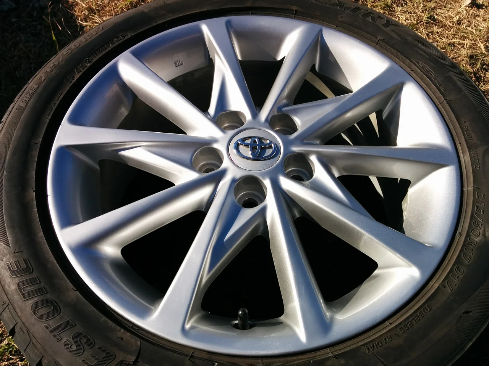

こんにちは、急に寒くなりましたね。 まだ冬支度をしていなかったので

焦りました。（汗） スタッドレスの履き替えとかは大丈夫ですか？

ところで、今回はトヨタの純正ホイールのリペアです。

ビフォーがこれ

キズのアップ

アフターがこれ

リムのキズもスポークのキズもキレイになりました。

スタッドレスに履き替えたタイミングでついでにリペアしてみませんか？

買い替えを考える前にリペアも選択肢に考えてみてください。
