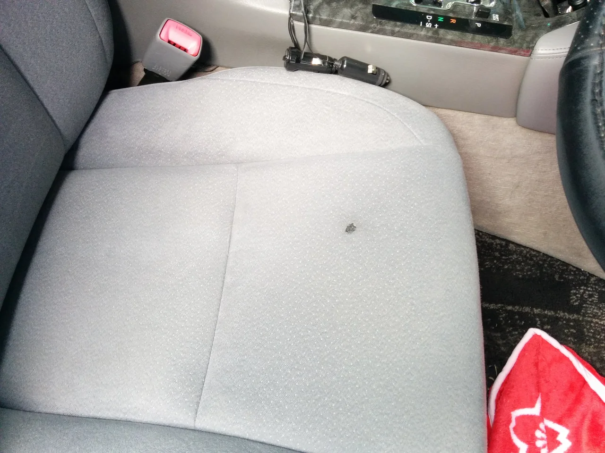
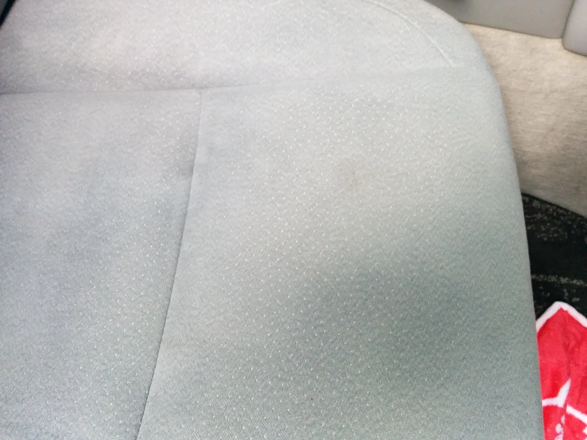
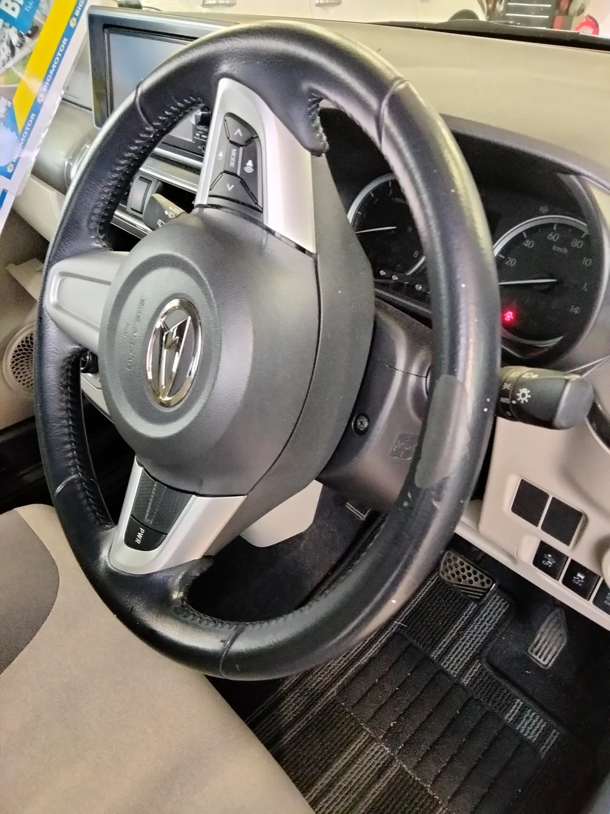
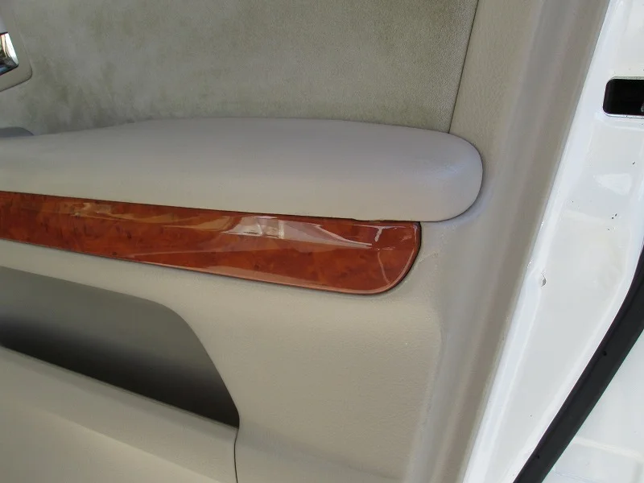

## 交換せずに修復します

レザーシート・モケットシート・ダッシュボード・ステアリング・内張りなど、内装各部の傷みを交換せずに修復いたします。

### シートのタバコのコゲ穴

タバコのコゲ穴、シートの破れ、ハンドルのテカリなどは、部品を交換することなく元の状態に近づけることができます。とくにシートのコゲ穴は、当店で最も多いご依頼です。

 

左：施工前／右：施工後

## ステアリング・運転席まわり

ステアリングや運転席まわりは、運転のたびに目に入る箇所です。傷みが気になり始めたら、早めのご相談をおすすめします。

### ハンドルのテカリ・色剥げ

ステアリングは手の汗などの影響で傷みやすく、エアバッグを備えた現行車では交換も容易ではありません。

 

左：施工前／右：施工後

### 早めのご相談について

傷みが広がる前にご相談いただくことで、費用を抑えられる場合があります。

## 対応する傷みの例

### シートまわり

- 愛車のシートにタバコのこげ穴ができてしまった
- 革のシートが擦れて色が剥げてしまった
- シートに飲み物をこぼしてシミがついてしまった

### ハンドル・ダッシュボード

- ハンドルが擦れて変色してしまった
- ダッシュボードに機器を取り付けてキズがついてしまった
- 使わなくなった機器を外したら、ダッシュボードにビス穴が残った
- お気に入りの中古車のダッシュボードにビス穴や割れがある

### ドア・内張り・天井

- ドアの内張りやアームレストが破れてしまった
- シートベルトの金具を挟んでしまい、内張りに傷がついた
- ルーフ（天張り）にシミや穴が空いてしまった

 

左：施工前／右：施工後

### その他

- オークションで仕入れた中古車に目立つキズがあり、売れなくて困っている（ディーラー様の声）
- お気に入りのソファーや革製品が擦れて傷みが目立つ

経年劣化による破れ、ナビ取り付けのビス跡、タバコのコゲ穴、擦れによる欠損、衝撃による割れなど、内装に関するさまざまなご要望に対応いたします。

## 部品供給のない車・輸入車のリペア

輸入車・旧車・福祉車両は、部品の入手が困難であったり高額になったりする傾向があります。交換部品の供給が終了した車両、オークションで仕入れた中古車、納車前の1台など、これまでも数多くのご相談を承ってまいりました。

### 出張施工（車を預けずに）

ステアリングなどは装着したまま出張で施工できますので、お車をお預けいただく必要はありません。

## 品質・安全への取り組み

### リペア分野で世界唯一のISO9001

トータルリペアは、リペア分野において世界で唯一ISO9001を取得しています。施工手順の品質が継続的に維持されていることの証明です。

### 航空機内装の基準を通過

米国では、民間旅客機の内装リペアに関する厳格なテストを通過し、トータルリペアのインテリアリペア使用許可を取得しています。

### 安全を考えた材料

インテリアリペアで使用する塗料は、すべての材料にMSDS（製品安全データシート）が付属しており、施工後にお車へ乗られる方の安全に配慮した品質です。有機溶剤などの有害なものを含まない水性塗料を使用し、伸縮する素材に追従する補修材と、擦れに強い強化剤を組み合わせています。
