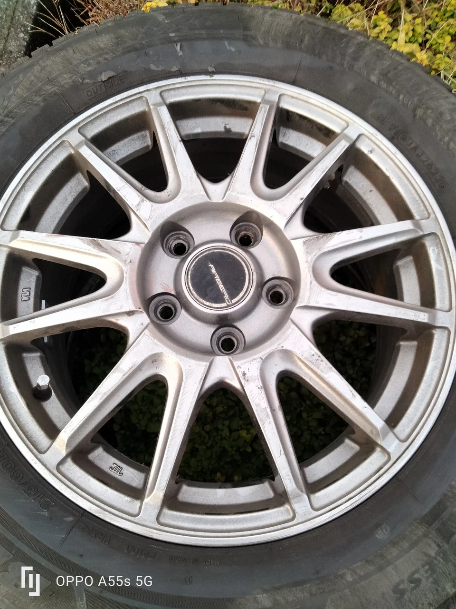
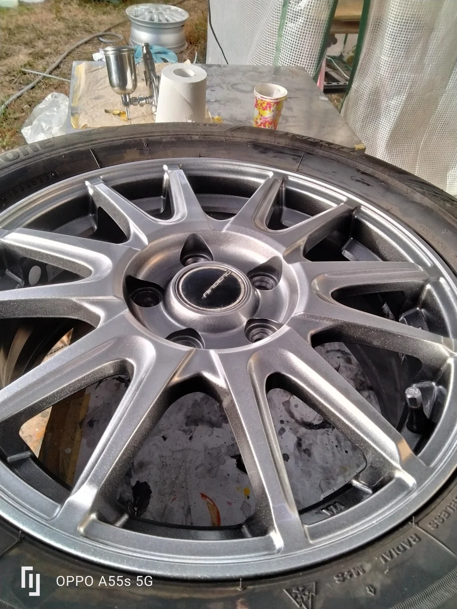
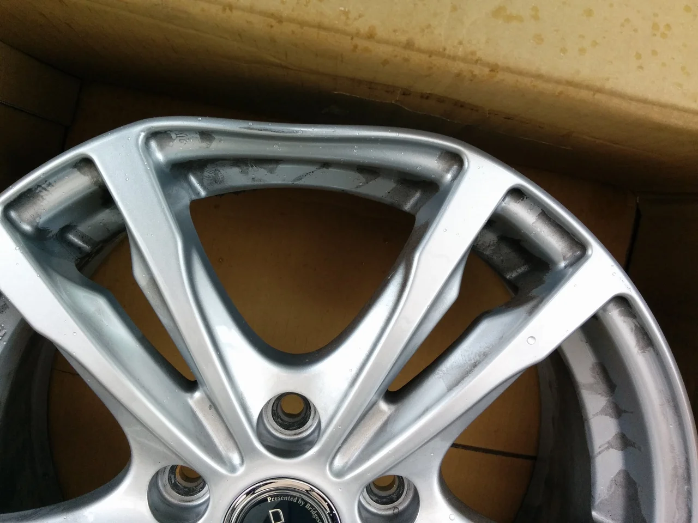
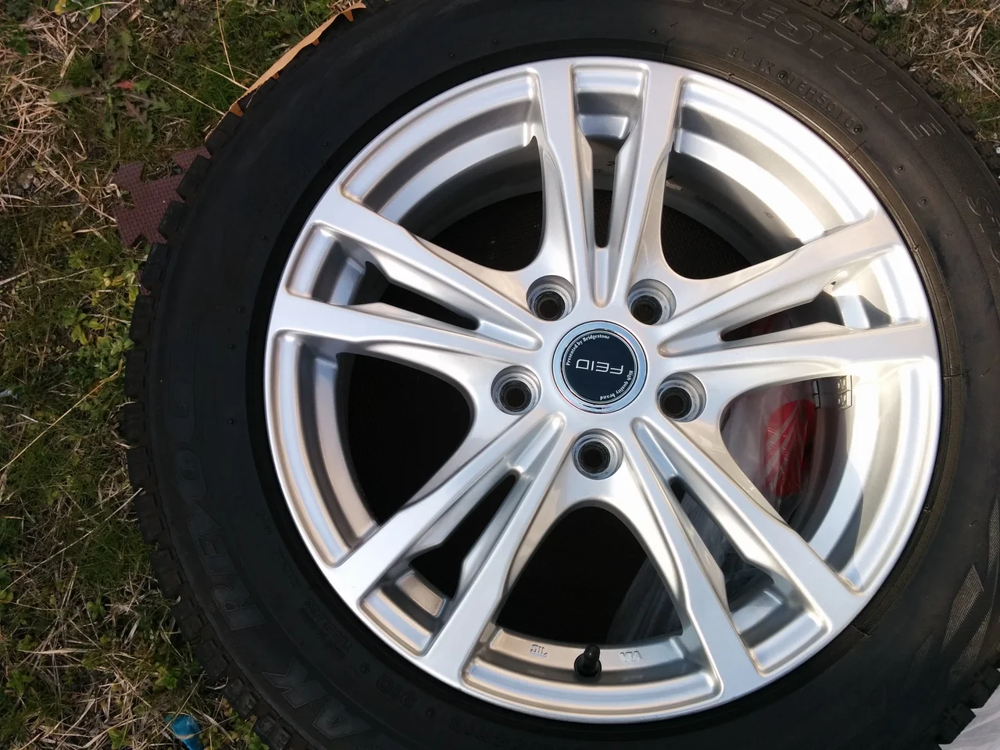

## タイヤを付けたまま施工できます

ホイールのキズ・欠け・歪みを修復いたします。表面の浅いキズであれば、タイヤを装着したまま施工することも可能です。

### タイヤ交換・履き替えのついでに

タイヤ交換やスタッドレスタイヤへの履き替えのタイミングにあわせて、ご依頼いただけます。1本からのお持ち込みにも対応いたします。

## ガリキズ・キズのリペア

駐車時の接触などで生じるガリキズは、深い場合であってもリペアで目立たなくできることが多いです。交換をご検討される前に、まずはご相談ください。

 

左：施工前／右：施工後

### 交換との費用比較

4本すべてを交換する場合と比較して、リペアはおよそ1/8〜1/10の費用で収まるケースが大半です。とくに社外ホイールは1本単位での入手が難しく、廃盤となっている場合は新品の確保ができません。同一モデルをお使い続けいただくためにも、リペアという選択肢をご検討ください。

## ポリッシュ・アルマイト・メッキのキズ

### 研磨でしか直せない面

ポリッシュ・アルマイト・メッキ面のキズは、塗装で隠すことができません。表面を均一に研磨し、鏡面の光沢を復元いたします。

### ポリッシュ（ダイヤカット）の直し方3通り

 

左：施工前／右：施工後

- **ダイヤカット再施工** ── 専用機でヘアラインを切り直す、最も品質の高い方法です。価格は最も高くなります。
- **ポリッシュ風塗装** ── 塗装で光沢を合わせます。ヘアラインの再現はできませんが、比較的リーズナブルです。
- **研磨リペア** ── デザインによって対応が可能です。

傷みの状態とご予算に応じて、最適な方法をご提案いたします。お見積りは無料です。

## ハイパー塗装・ハイグロスハイパー塗装

### ハイパーカラーとは

高級車や輸入車に多く採用されている、金属調の輝きを持つ塗装です。一般的な塗装では再現が難しい光沢を、専用の特殊塗料を用いて再生します。粒子が細かくメタリック感の強いハイパーカラーにも対応いたします。

 

左：施工前／右：施工後

### 調色（色合わせ）

メタルフレークやパールの粒子まで調色で合わせます。現物がお手元にない場合も、お写真から色を起こすことが可能です。明るさ・暗さの調整も承りますので、サンプルをご確認のうえご指定ください。

### 艶消し・半艶・塗り分け

艶消し・半艶の仕上げ、見切りラインの塗り分けにも対応いたします。ご希望の仕様がございましたらお聞かせください。

## 再塗装・カラーチェンジ

### 色あせ・腐食・落ちない汚れ

色あせ・腐食・落ちにくい汚れは、再塗装によりリフレッシュできます。ボディカラーに合わせたカラーチェンジにも対応いたします。

### オーダーカラー

キャンディーカラー（ラメ入り）やガンメタリックなどもお選びいただけます。ご指定の色に塗装するオーダーにも対応しており、既存の塗装からのカラーチェンジも承ります。

## 曲がり・欠けのリペア

### 欠け（アルミフィラーによる補修）

 

左：施工前／右：施工後

欠損部分はアルミ専用のフィラーで充填・整形したうえで、再塗装いたします。

### 曲がり修正

曲がり修正にも対応いたしますが、硬質なワンピースホイールなどは修正できない場合があります。メーカーでの対応が難しいというご相談も承りますので、まずはお問い合わせください。なお、リペア後の強度が新品同等まで戻るものではないため、その後の使用状況によっては交換をおすすめしております。

※ホイール塗装、ハイパー塗装に限ります。 ※ホイールカラーチェンジのご依頼は、原則4本から承ります。

